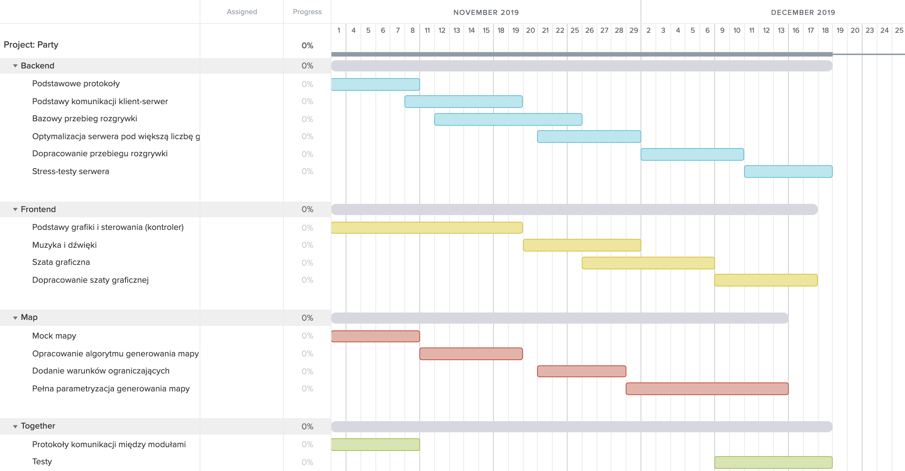

# Project: Party
Wieloosobowa gra imprezowa tworzona na potrzeby kursu Programowanie Zespołowe na semestrze zimowym 2019/2020 na WPPT, PWr.

## Zespół
- **Karol Kobiałka (team leader)**
- Piotr Kołodziejczyk
- Bartosz Rajczyk
- Michał Wawrzyniak
- Paweł Wilkosz (zastępca)

## Analiza biznesowa

### Opis projektu
Project: Party ma być wieloosobową grą uruchamianą w przeglądarce. Gracze będą używali swoich telefonów jako kontrolera, a rozgrywka wyśletlana będzie na osobnym monitorze wspólnym dla wszystkich graczy, stąd też "imprezowy" charakter tytułu.

Motywacją do powstania _Project: Party_ jest chęć utworzenia gry, w którą będą mogli zagrać wszyscy uczestnicy spotkania towarzyskiego, kiedy posiada ją jedynie jedna osoba z nich.

### Istniejące rozwiązania na rynku
Jesteśmy świadomi istnienia podobnych rozwiązań na rynku, z czego najpopularniejszym z nich jest gra _Jackbox_. Nasz projekt będzie odróżniała prostota rozgrywki oraz jej formuła.

## Wymagania funkcjonalne

### Podstawowe
Wymagania, które ma spełniać aktualna wersja rozwijanej gry:
- **Lokalny serwer rozgrywki** 
  - Jedno z głównych założeń projektu to płynny i niezakłócony przebieg rozgrywki, nawet w przypadku gorszego dostępu do internetu. Ograniczenie rozrywki do sieci lokalnej umożliwi zachowanie minimalnych opóźnień, niezależnie od warunków.
- **Tworzenie lobby gry** 
  - Możliwość podziału jednej instancji serwera do prowadzenia wielu rozgrywek umożliwi przebieg paru równoczesnych rywalizacji, np. w sytuacjach turniejowych.
- **Strona internetowa pełniąca funkcja kontrolera** 
  - Implementacja sterowania postacią gracza w postaci strony internetowej pozwoli zarówno zaoszczędzić czas, który musiałby zostać poświęcony na stworzenie aplikacji natywnych, jak i jednolitą formę rozgrywki dla każdego urządzenia. Powinna umożliwić wybranie pseudonimu gracza.
- **Możliwość dołączenia do lobby przez graczy** 
  - Dołączenie do lobby rozgrywki powinno opierać się na wpisaniu identyfikatora pokoju na stronie służącej za kontroler dla gracza.
- **Zrozumiały i jednolity przebieg rozgrywki** 
  - Rozgrywka oparta będzie na zasadzie "każdy na każdego". Gracze kontrolują ruch i atak swoich postaci, a zwycięzcą rundy zostaje gracz z największą liczbą zabójstw. Po rozegnaniu odpowiedniej liczby rund, rozgrywka kończy się i wybrany zostaje ostateczny zwycięzca.
- **Mapa generowana parametrycznie** 
  - Na początku każdej rundy generowana jest plansza, składająca się z otwartej przestrzeni wypełnionej wielokątami, pełniącymi funkcję przeszkód. Rozmiar planszy zależy od ilości graczy.
- **Krąg śmierci** 
  - Długość tury ograniczona będzie przez zacieśniający się z krawędzi planszy "krąg śmierci", mający na celu nie dopuścić do sytuacji, w której dwóch ostatnich graczy nie walczy ze sobą, "kampi".

### Dodatkowe
Funkcjonalności rozważane w kolejnych iteracjach projektu:
- tzw. "power-upy" zmieniające tymczasowo zachowanie się gracza podnoszącego je
- serwer globalny, hostowany na serwerze publicznym
- listy rankingowe najlepszych graczy

### Niefunkcjonalne
Wymagania niezwiązane z funkcjonalnością gry:
- płynna rozgrywka; osiąganie co najmniej 60 klatek na sekundę na różnych urządzeniach, brak opóźnień
- komfortowe sterowanie
- atrakcyjna grafika; "neon-noir"

## Ryzyka
Projekt może okazać się trudny w realizacji i utrzymaniu w wielu aspektach, takich jak:
- **Wydajność backendu**
  - Rozgrywka opiera się na założeniu płynności, ponieważ przebiega w czasie rzeczywistym i wymaga odpowiednich czasów reakcji ze strony gracza. Jeśli backend nie będzie nadążał z obliczeniami, gracze mogą się irytować.
  - Kalkulacje wymagane w przebiegu rozgrywki nie są skomplikowane, więc prawdopodobieństwo ryzyka ogranicza się do zastosowania odpowiednich metod matematycznych.
  - W przypadku wystąpienia problemu z optymalizacją, można uprościć schemat rozgrywki bądź dokonać ściślejszych optymalizacji (np. poprzez zmianę używanych protokołów)
- **Niekomfortowe sterowanie**
  - Sterowanie jest czynnikiem który może sprawić, że słaba gra będzie hitem, a jednocześnie z dobrej gry zrobić bezużyteczny produkt. Odpowiedni UX jest krytycznym czynnikiem w przypadku prostego schematu rozgrywki.
  - Odtworzenie formy pada na ekranie telefonu zostało już wielokrotnie przetestowane (emulatory GameBoy Advance bądź SNES), ryzyko leży więc po stronie implementacji. W wypadku problemów, można skorzystać z gotowych rozwiązań.
- **Trudności z poprawnym generowaniem planszy**
  - Bugi wynikające z losowo generowanych map znane są każdemu graczowi, jednak w środowisku kompetytywnym prowadzą raczej do irytacji, prowadzić mogą bowiem do nierównej rozgrywki (np. odcięcie jednego gracza od reszty, efektywnie zapewniając zwycięstwo w danej rundzie)
  - Modele prostych generatorów zostały już wielokrotnie wykonane, więc przy świadomym korzystaniu z dostępnej wiedzy ryzyko wystąpienia problemów oceniamy na średnie.
  - W przypadku większych problemów, można wykorzystać zdefiniowane wcześniej elementy w celu generacji całości, co powinno ograniczyć złożoność procesu.
- **Czytelna rozgrywka w rozdzielczości Full HD**
  - Wyzwanie będzie polegało na wyświetleniu na ekranie całości planszy, jednocześnie zapewniając komfortową i ekscytującą rozgrywkę dla wielu graczy.
  - Odpowiednie skalowanie rozmiaru zarówno postaci, jak i przeszkód, będzie kluczowym czynnikiem w redukcji szans wystąpienia tego problemu. 

## Narzędzia używane do realizacji

### Narzędzia wspomagające rozwój oprogramowania
|Zagadnienie           |Narzędzia               |
|----------------------|------------------------|
|system kontroli wersji|git + GitHub            |
|ciągla intergracja    |GitHub CI               |
|serwer/chmura         |DigitalOcean, własny VPS|
|komunikacja zespołu   |Slack                   |

### Języki programowania, technologie i biblioteki
|Zagadnienie           |Narzędzia               |
|----------------------|------------------------|
|język backendu        |Go                      |
|serwer http           |net/http (serwer Go)    |
|frontend              |JavaScript              |
|renderowanie gry      |WebGL                   |
|komunikacja z frontem |gorilla/websocket       |

## Harmonogram
1. Podstawowe protokoły - pierwsze dwa tygodnie
   - Konieczne jest wykonanie najbardziej podstawowych rozwiązań i stworzenie protokołów komunikacji między nimi (API). Umożliwi to dalszą, oddzielną pracę nad konkretnymi elementami aplikacji.
2. Podstawy komunikacji między klientem a serwerem - do prototypu
   - Prototyp wymaga funkcjonalnego backendu, natomiast optymalizacja pod większą liczbę graczy nie jest na tym etapie jeszcze konieczna.
3. Podstawy grafiki i sterowania - do prototypu
   - Do przeprowadzenia prototypowej rozgrywki wymagane będzie podstawowe sterowanie oraz wyświetlanie stanu gry.
3. Bazowa rozgrywka - do prototypu
   - Pierwszy prototyp zakłada umożliwienie dwóm graczom przeprowadzenie rozgrywki w najprostszej postaci. Wymaga to podstawowej mapy, funkcjonującej komunikacji między klientem i serwerem oraz podstawowego sterowania oraz wyświetlania przebiegu rozgrywki.
4. Rozwój generacji mapy - wersja beta
   - Wersja beta powinna zawierać mapy generowane losowanie, konieczne będą więc kolejne prace nad jej rozwojem
5. Optymalizacja serwera pod większa ilosć graczy - wersja beta
   - Projekt zakłada komfortową rozgrywkę dla 10 graczy, konieczne więc będzie upewnienie się, że serwer jest w stanie obsłużyć większy ruch.
6. Kompletna szata graficzna gry - wersja beta
   - Szata graficzna powinna być sfinalizowana do wersji beta projektu, by umożliwić ewentualnie przeniesienie zasobów ludzkich w bardziej potrzebne rejony aplikacji.
7. Stress-testy rozgrywki - przed wersją beta
   - Należy zweryfikować zachowanie serwera w skrajnych warunkach obciążenia, jak i również przyszłych, prawdziwych warunkach użytkowych
8. Dodatkowe funkcjonalności - po wersji beta, przed wersją finalną
   - W przypadku pozytywnego przebiegu testów wersji beta należy wziąc pod uwagę potencjalne dodatkowe funkcjonalności, np. wspomnianie power-upy. 
   

## Specyfikacja techniczna

### Komponenty projektu
Projekt skłądać będzie się z trzech głównych części. Są nimi:
- **frontend gry** - wyświetla aktualny status rozgrywki na ekranie
- **frontend kontrolera** - przekazuje ruchy gracza do backendu
- **backend** - odbiera ruchy graczy, interpretuje je i wysyła aktualną sytuację w grze do frontendu gry

### Przepływ danych

Komunikacja podczas rozgrywki:

Komunikacja w całej aplikacji:

### Przydział obowiązków do części
|Część projektu        |deweloperzy                           |
|----------------------|--------------------------------------|
|backend               |Karol Kobiałka, Paweł Wilkosz         |
|frontend gry          |Bartosz Rajczyk                       |
|frontend kontrolera   |Bartosz Rajczyk                       |
|parametryczna mapa    |Piotr Kołodziejczyk, Michał Wawrzyniak|

## Mocki graficzne

### Frontend kontrolera

### Frontend gry

