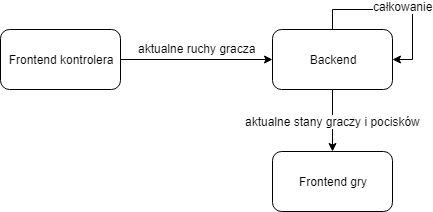
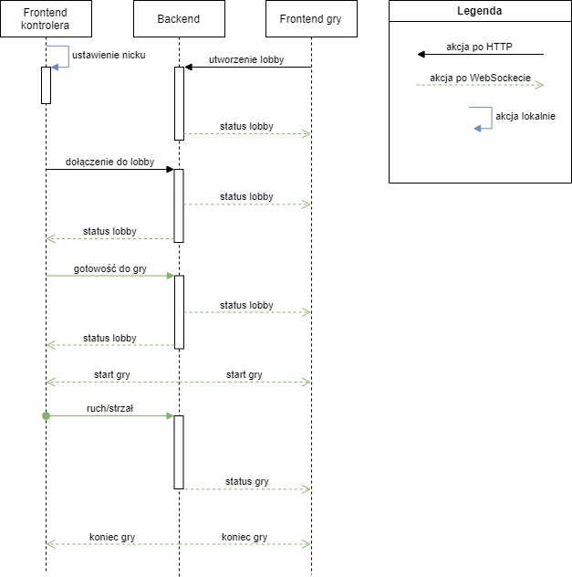
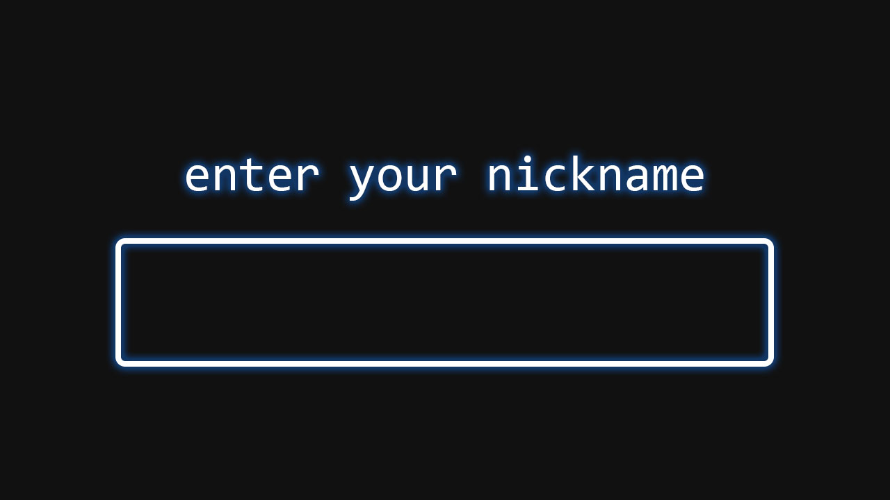
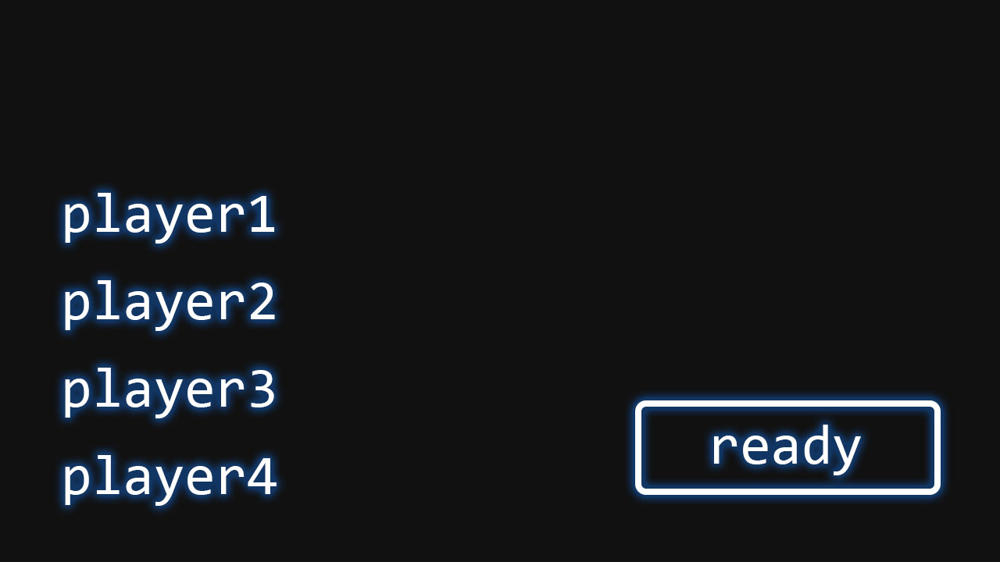
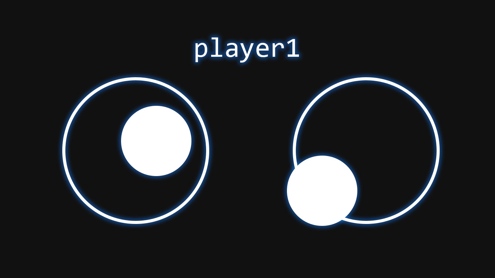
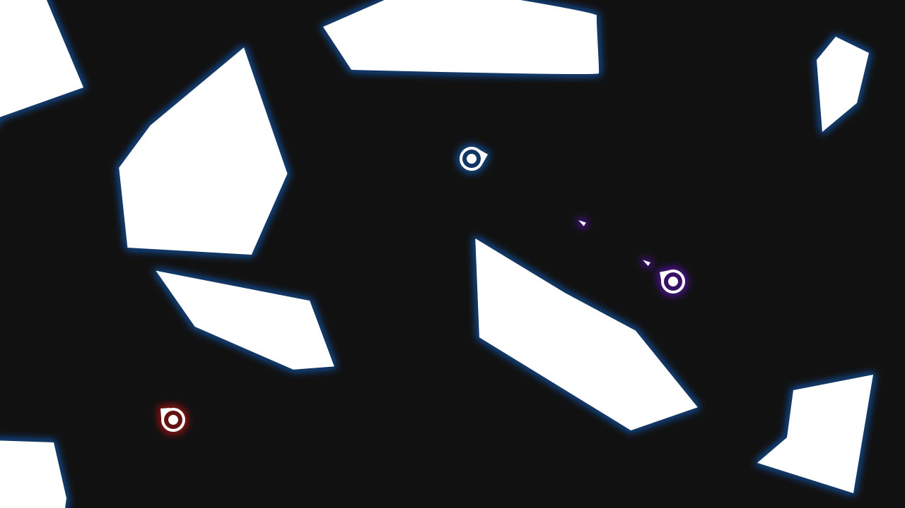

# Project: Party
Wieloosobowa gra imprezowa tworzona na potrzeby kursu Programowanie Zespołowe na semestrze zimowym 2019/2020 na WPPT, PWr.

## Zespół
- **Karol Kobiałka**
- Piotr Kołodziejczyk
- Bartosz Rajczyk
- Michał Wawrzyniak
- Paweł Wilkosz

## Analiza biznesowa

### Opis projektu
Project: Party ma być wieloosobową grą uruchamianą w przeglądarce. Gracze będą używali swoich telefonów jako kontrolera, a rozgrywka wyśletlana będzie na osobnym monitorze wspólnym dla wszystkich graczy, stąd też "imprezowy" charakter tytułu.

Motywacją do powstania _Project: Party_ jest chęć utworzenia gry, w którą będą mogli zagrać wszyscy uczestnicy spotkania towarzyskiego, kiedy posiada ją jedynie jedna osoba z nich.

### Istniejące rozwiązania na rynku
Jesteśmy świadomi istnienia podobnych rozwiązań na rynku, z czego najpopularniejszym z nich jest gra _Jackbox_. Nasz projekt będzie odróżniała prostota rozgrywki oraz jej formuła.

## Wymagania funkcjonalne

### Podstawowe
Wymagania, które ma spełniać aktualna wersja rozwijanej gry:
- utworzenie serwera gry na sieci lokalnej
- utworzenie lobby gry
- hostowanie strony internetowej będącej kontrolerem poszczególnych graczy, umożliwiającej wybór pseudonimu
- możliwość dołączenia do lobby gry o konkretnym identyfikatorze przez graczy
- rozgrywka oparta na zasadzie "każdy na każdego", gdzie gracze kontrolują ruch i atak swoich postaci; zwycięscą zostaje gracz z największą liczbą zabójstw innych graczy
- rozgrywka turowa, tura kończący się, kiedy na planszy zostaje ostatni gracz
- plansza generowana parametrycznie, losowa w każdej turze
- długość tury ograniczona przez zacieśniający się "krąg śmierci" z krawędzi planszy, mający na celu zmniejszyć liczbę sytuacji, gdzie dwóch ostatnich graczy nie walczy ze sobą

### Dodatkowe
Funkcjonalności rozważane w kolejnych iteracjach projektu:
- tzw. "power-upy" zmieniające tymczasowo zachowanie się gracza podnoszącego je
- serwer globalny, hostowany na serwerze publicznym
- listy rankingowe najlepszych graczy

### Niefunkcjonalne
Wymagania niezwiązane z funkcjonalnością gry:
- płynna rozgrywka; osiąganie co najmniej 60 klatek na sekundę na różnych urządzeniach, brak opóźnień
- komfortowe sterowanie
- atrakcyjna grafika; "neon-noir"

## Ryzyka
Projekt może okazać się trudny w realizacji i utrzymaniu w wielu aspektach, takich jak:
- problemy z wydajnością backendu przeliczającego ruchy graczy
- przejęcie rynku docelowego przez inną grę
- niekomfortowe sterowanie
- zmiana koncepcji w wypadku napotkania przeszkód czasowych
- trudności z poprawnym generowaniem planszy
- czytelna rozgrywka w rozdzielczości Full HD

## Narzędzia używane do realizacji

### Narzędzia wspomagające rozwój oprogramowania
|Zagadnienie           |Narzędzia               |
|----------------------|------------------------|
|system kontroli wersji|git + GitHub            |
|ciągla intergracja    |GitHub CI               |
|serwer/chmura         |DigitalOcean, własny VPS|
|komunikacja zespołu   |Slack                   |

### Języki programowania, technologie i biblioteki
|Zagadnienie           |Narzędzia               |
|----------------------|------------------------|
|język backendu        |Go                      |
|serwer http           |net/http (serwer Go)    |
|frontend              |JavaScript              |
|renderowanie gry      |WebGL                   |
|komunikacja z frontem |gorilla/websocket       |

## Specyfikacja techniczna

### Komponenty projektu
Projekt skłądać będzie się z trzech głównych części. Są nimi:
- **frontend gry** - wyświetla aktualny status rozgrywki na ekranie
- **frontend kontrolera** - przekazuje ruchy gracza do backendu
- **backend** - odbiera ruchy graczy, interpretuje je i wysyła aktualną sytuację w grze do frontendu gry

### Przepływ danych

Komunikacja podczas rozgrywki:

Komunikacja w całej aplikacji:

### Przydział obowiązków do części
|Część projektu        |deweloperzy                           |
|----------------------|--------------------------------------|
|backend               |Karol Kobiałka, Paweł Wilkosz         |
|frontend gry          |Bartosz Rajczyk                       |
|frontend kontrolera   |Bartosz Rajczyk                       |
|parametryczna mapa    |Piotr Kołodziejczyk, Michał Wawrzyniak|

## Mocki graficzne

### Frontend kontrolera

### Frontend gry
