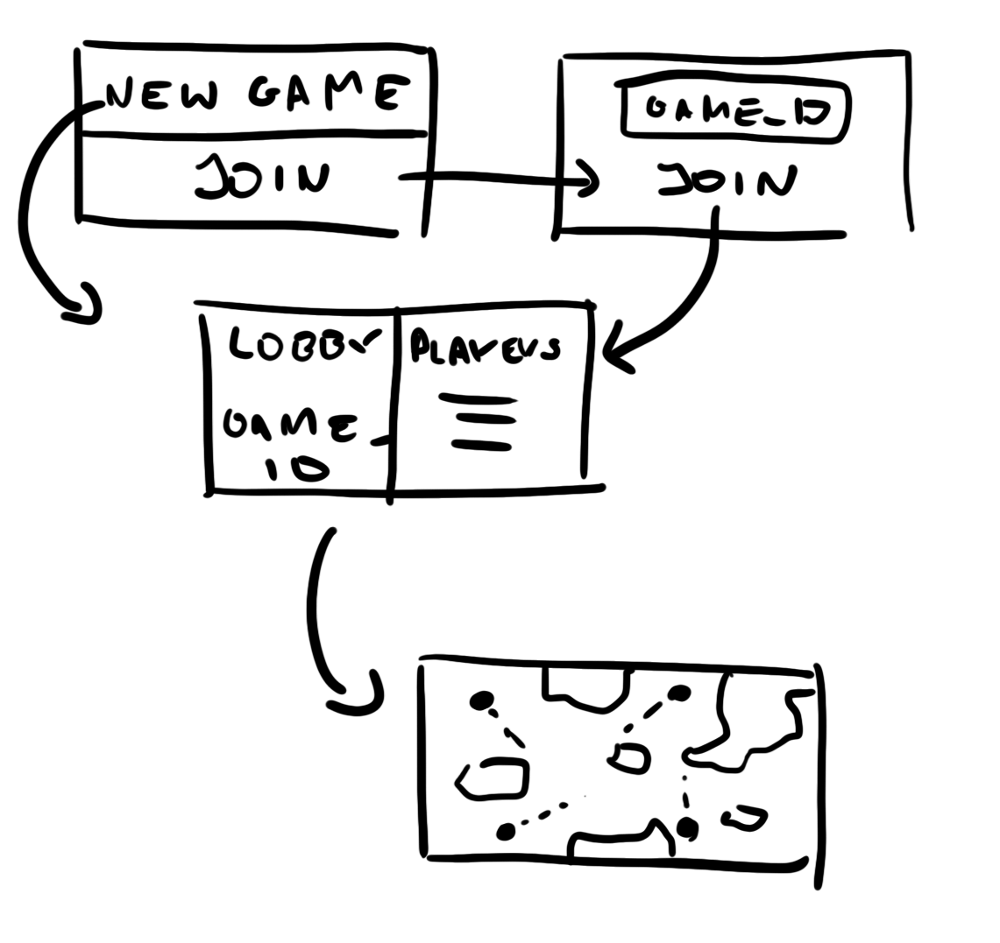
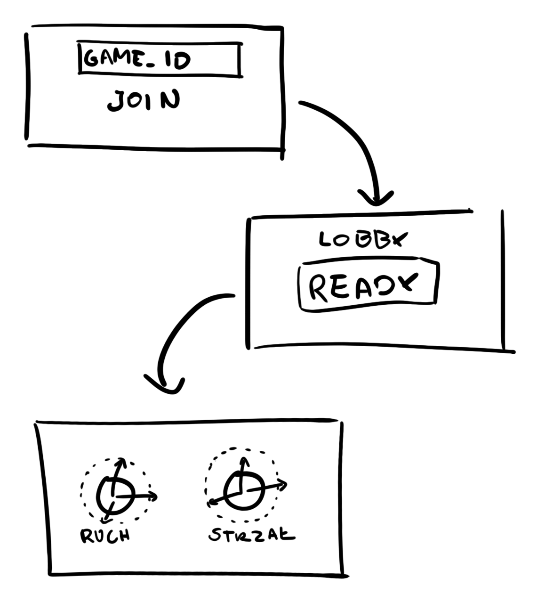

# Project: Party
Projekt zrealizowany na potrzeby kursu "Programowanie Zespołowe". Ten dokument zawiera zarys koncepcyjny realizowanego projektu, wczesne szkice funkcjonalności oraz możliwe implementacje techniczne.

## Opis projektu

### Zarys rozgrywki
Project: Party ma być wieloosobową grą uruchamianą w przeglądarce. Gracze będą używali swoich telefonów jako kontrolera, a rozgrywka wyśletlana będzie na osobnym monitorze wspólnym dla wszystkich graczy, stąd też "imprezowy" charakter tytułu. Gra składałaby się wtedy z trzech głównych części:
- backendu,
- frontendu wyświetlajaćego rozgrywkę,
- frontendu będącego kontrolerem.

Taka architektura pozwoli na dużą swobodę rozgrywki w różnych okolicznościach.

Sama rozgrywka ma rozgrywać się na parametrycznie generowanej, prostej mapie z płaskim widokiem z góry; każdy gracz będzie kontrolował swoją postać wybierając kierunek ruchu oraz wystrzeliania pocisków. Gracze będą mogli zbierać pojawiające się losowo na mapie wzmacniacze/bronie. Trafienie innego gracza będzie skutkowało wykluczeniem go z trwającej aktualnie rundy aż do samego końca; na koniec rundy każdy gracz otrzyma liczbę punktów adekwatną do liczby pokonanych graczy. Każda rozgrywka składać się będzie z kilku lub kilkunastu takich rund.

### Części projektu
#### Frontend kontroler
Teoretycznie najprostsza część projektu - odpowiedzialny za samo przekazywanie akcji gracza do serwera. Powinien nawiązywać jednokierunkową komunikację z serwerem.

#### Frotnend gra
Cześć służąca głównie do tworzenia, zarządzania i wyświetlania rozgrywki. Wyświetla ona lobby dla graczy oraz samą grę.

#### Backend
Zbiera inputy z kontrolerów i wysyła wszystkie zmiany do frontendu gry.

## Zarys funkcjonalny/techniczny
### Tworzenie rozgrywek
Serwer powinien tworzyć każdą rozgrywkę z unikalnym, losowym identyfikatorem, który potem zostaje udostępniany graczom chcącym do danej rozgrywki dołączyć. Frontend wyświetlający grę powinien umożliwić utworzenie nowej lub podpięcie się do istniejącej gry używając znanego nam identyfikatora, następnie wyświetlić lobby rozgrywki z widocznym jej identyfikatorem w celu umożliwienia dołączenia do niej graczom. Rysunek koncepcyjny:

Jednocześnie frontend kontroler może w kroku z lobby wykorzystać identyfikator, aby do niego dołączyć i wyrazić gotowość do rozpoczęcia gry:

### Mapa
Mapa gry ma być parametryczna, tj. tworzona obliczeniowo i deterministyczna dla określonych parametrów wejściowych. Algorytm wyznaczający jej ograniczenia (miejsca, w których gracze nie mogą się poruszać ani przez które nie przelatują strzały) powinien być identyczny po stronie serwera i frontendu rysującego grę, aby umożliwiać obliczanie stanu rozgrywki po stronie serwera.

### Wyświetlanie rozgrywki
Serwer powinien odpowiadać za zbieranie danych wejściowych z kontrolerów graczy, wykonywanie odpowiednich obliczeń na ich podstawie i wysyłanie określiną liczbę razy na sekundę aktualnych pozycji graczy lub/i pocisków przez nich wystrzelonych w celu umożliwienia frontendowi narysowania kolejnych sytuacji na mapie.

## Zarys implementacyjny
### Komunikacja w grze
Komunikacja pomiędzy częściami powinna odbywać się możliwie szybko, część z niej powinna być przesyłana tylko i wyłączenie z kontrolera do serwera, część z serwera tylko do frontendu z grą. Gra powinna używać własnego, prostego i liniowego kodowania ruchów graczy oraz zmian w statusie gry przesyłanego w czasie rzeczywistym. 

Proponowane rozwiązanie: **WebSockety**

### Hostowanie frontendów
Serwer powinien dostarczać statyczne widoki w postaci stron internetowych wypełniane potem przez komunikację wspomnianą we wcześniejszym punkcie.

Proponowane rozwiązanie: **serwer net/http**

### Rysowanie rozgrywki
Stan gry powinien mieć reprezentację obiektową, która przy kolejnych informacjach przesyłanych z serwera będzie aktualizowana i rysowana na nowo. Rysowanie powinno odbywać się możliwie szybko i wydajnie.

Proponowane rozwiązanie: **WebGL**

## Mocki graficzne

### Przykładowy interfejs gry

